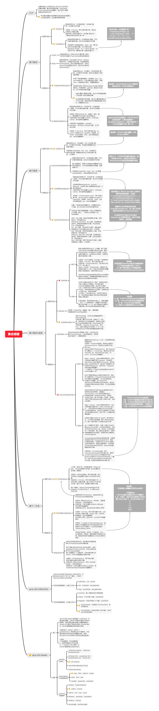

- [前言](#前言)
- [并发与集合的定义](#并发与集合的定义)
- [JAVA语言的水深](#java语言的水深)
- [如何学习并发与集合](#如何学习并发与集合)
- [项目成果](#项目成果)
- [文章目录](#文章目录)
  - [第0章：源码分析](#第0章源码分析)
  - [第1章：JAVA线程基础](#第1章java线程基础)
  - [第2章：并发三大特性](#第2章并发三大特性)
  - [第3章：抽象队列同步器](#第3章抽象队列同步器)
  - [第4章：并发与集合总结](#第4章并发与集合总结)
  - [第5章：HashMap总结](#第5章hashmap总结)
- [思维导图](#思维导图)
  - [并发编程](#并发编程)
  - [集合容器](#集合容器)

# 深入理解JAVA并发与集合

### 前言

我希望写多篇文章，组合成一份文章集，包含关于JAVA并发与集合的入门原理、常见问题、代码例子证明等

读者阅读它，能像读小说一样，从第一篇文章，读到最后一篇文章，尽量把讳莫如深难懂的内容写得简单易懂，当然这也需要读者具有一定的JAVA功底

并发问题是比较抽象的，一个并发程序的执行结果可能会出乎程序员的预料，并发的不确定性让编程工作具有挑战性

**声明**

转载请注明出处：https://github.com/peteryuanpan/notebook/blob/master/深入理解JAVA并发与集合

本文部分内容来自鲁班学院的课程，感谢老师们以及同学们对我的帮助，这里尤其感谢一下fox老师，您的课是讲得真好！

参考的书籍：《深入理解JAVA虚拟机》、《JAVA并发编程之美》

参考的优秀博文：[Snailclimb/JavaGuide](https://github.com/Snailclimb/JavaGuide)、[深入浅出JAVA多线程](http://concurrent.redspider.group/)

### 并发与集合的定义

在计算机科学中，并发是一种能力，指在一个系统中，拥有多个计算，这些计算有同时执行、潜在交互的特性，但不影响计算结果

> In computer science, concurrency is the ability of different parts or units of a program, algorithm, or problem to be executed out-of-order or in partial order, without affecting the final outcome. From https://en.wikipedia.org/wiki/Concurrency_(computer_science)

在计算机科学中，集合是一个抽象的概念，它的具象容器可装载零至多个，有相同类型且可放在一起操作的数据

> In computer science, a collection or container is a grouping of some variable number of data items (possibly zero) that have some shared significance to the problem being solved and need to be operated upon together in some controlled fashion. A collection is a concept applicable to abstract data types, and does not prescribe a specific implementation as a concrete data structure. From https://en.wikipedia.org/wiki/Collection_(abstract_data_type)

### JAVA语言的水深

JAVA这潭大湖，从上往下，一共有7层（人为定义的）

- JAVA语法
- JAVA字节码
- JVM原理
- JVM源码
- 操作系统层
- 汇编码层
- CPU层

在[深入理解JAVA虚拟机-第一至三层](../深入理解JAVA虚拟机-第一至三层)文章集中，我强调了文章内容只包含1-3层，不考虑4层以下，且只在单线程的情况下总结JVM原理，而本篇文章集需要讨论的是多线程与并发问题

### 如何学习并发与集合

学习方向：基础概念 + 代码例子 => 源码阅读 + 图解分析 => 应用实战

学习方法
- 看视频和文章，辩证地理解清楚多个基础概念，要有代码例子，记录笔记（点）
- 自行阅读并发和集合类中的源码，同时画图分析，写成文章（线），形成文章集（面）
- 做高并发相关的工具或项目，用到线程池、锁、原子类、集合等技术，从应用实战中理解（体）

### 项目成果

并发日志下载工具：https://github.com/peteryuanpan/qlogfetch2

### 文章目录

#### 第0章：源码分析
- [HashMap](源码分析/HashMap.md)
- [JDK7.ConcurrentHashMap](源码分析/JDK7.ConcurrentHashMap.md)
- [JDK8.ConcurrentHashMap](源码分析/JDK8.ConcurrentHashMap.md)
- [ThreadPoolExecutor](源码分析/ThreadPoolExecutor.md)

#### 第1章：JAVA线程基础
- [JAVA线程基础](JAVA线程基础.md)
  - [进程与线程](JAVA线程基础.md#进程与线程)
  - [并发与并行](JAVA线程基础.md#并发与并行)
  - [启动线程](JAVA线程基础.md#启动线程)
    - [JAVA启动线程](JAVA线程基础.md#JAVA启动线程)
      - [Thread](JAVA线程基础.md#Thread)
      - [Runnable](JAVA线程基础.md#Runnable)
      - [Callable](JAVA线程基础.md#Callable)
      - [ExecutorService](JAVA线程基础.md#ExecutorService)
    - [JVM启动线程](JAVA线程基础.md#JVM启动线程)
  - [线程的生命周期](JAVA线程基础.md#线程的生命周期)
  - [等待唤醒机制](JAVA线程基础.md#等待唤醒机制)
    - [虚假唤醒](JAVA线程基础.md#虚假唤醒)
    - [Object等待唤醒](JAVA线程基础.md#Object等待唤醒)
    - [Thread等待唤醒](JAVA线程基础.md#Thread等待唤醒)
    - [LockSupport等待唤醒](JAVA线程基础.md#LockSupport等待唤醒)
  - [线程中断机制](JAVA线程基础.md#线程中断机制)
  - [并发基础概念](JAVA线程基础.md#并发基础概念)
    - [守护线程与用户线程](JAVA线程基础.md#守护线程与用户线程)
    - [线程上下文切换](JAVA线程基础.md#线程上下文切换)
    - [多线程模型](JAVA线程基础.md#多线程模型)
    - [用户态与内核态](JAVA线程基础.md#用户态与内核态)
    - [轻量级线程之协程](JAVA线程基础.md#轻量级线程之协程)

#### 第2章：并发三大特性
- [并发三大特性](并发三大特性.md)
  - TODO

#### 第3章：抽象队列同步器
- [抽象队列同步器](抽象队列同步器.md)
  - TODO

#### 第4章：并发与集合总结
- [并发与集合总结](并发与集合总结.md)
  - [进程与线程的区别是什么](并发与集合总结.md#进程与线程的区别是什么)
  - [线程与线程之间通信有哪些方式](并发与集合总结.md#线程与线程之间通信有哪些方式)
  - [进程与进程之间通信有哪些方式](并发与集合总结.md#进程与进程之间通信有哪些方式)
  - [说一下线程的6种状态及转换关系](并发与集合总结.md#说一下线程的6种状态及转换关系)
  - [说一下线程中断机制](并发与集合总结.md#说一下线程中断机制)
  - [说一下ThreadLocal的使用场景以及原理](并发与集合总结.md#说一下ThreadLocal的使用场景以及原理)
  - [ThreadLocal为什么会导致内存泄漏以及如何避免](并发与集合总结.md#ThreadLocal为什么会导致内存泄漏以及如何避免)
  - [JDK8中对并发做了哪些优化](并发与集合总结.md#JDK8中对并发做了哪些优化)
  - [说一下并发中的三大特性](并发与集合总结.md#说一下并发中的三大特性)
  - [说一下对volatile的理解](并发与集合总结.md#说一下对volatile的理解)
  - [volatile为何不能保证原子性](并发与集合总结.md#volatile为何不能保证原子性)
  - [synchronized与Lock锁的相同与不同点](并发与集合总结.md#synchronized与Lock锁的相同与不同点)
  - [说一下AQS中同步队列与条件队列的原理](并发与集合总结.md#说一下AQS中同步队列与条件队列的原理)
  - [说一下几个实现了AQS应用的使用场景](并发与集合总结.md#说一下几个实现了AQS应用的使用场景)
  - [线程池可解决的问题及适用的场景](并发与集合总结.md#线程池可解决的问题及适用的场景)
  - [线程池为何能做到线程复用](并发与集合总结.md#线程池为何能做到线程复用)
  - [说一下线程池中重要的参数及含义](并发与集合总结.md#说一下线程池中重要的参数及含义)

#### 第5章：HashMap总结
- [HashMap总结](HashMap总结.md)
  - [JDK7与JDK8中HashMap实现原理上的不同点](HashMap总结.md#JDK7与JDK8中HashMap实现原理上的不同点)
  - [JDK8中HashMap数组长度为何是2的幂次方](HashMap总结.md#JDK8中HashMap数组长度为何是2的幂次方)
  - [JDK8中HashMap数组什么时候扩容](HashMap总结.md#JDK8中HashMap数组什么时候扩容)
  - [JDK8中HashMap为什么要使用红黑树](HashMap总结.md#JDK8中HashMap为什么要使用红黑树)
  - [JDK8中HashMap什么时候将链表转化为红黑树](HashMap总结.md#JDK8中HashMap什么时候将链表转化为红黑树)
  - [JDK8中HashMap及TreeMap的红黑树实现原理](HashMap总结.md#JDK8中HashMap及TreeMap的红黑树实现原理)
  - [JDK8中HashMap如何实现序列化与反序列化](HashMap总结.md#JDK8中HashMap如何实现序列化与反序列化)
  - [JDK7中HashMap2个线程resize时循环链表问题](HashMap总结.md#JDK7中HashMap2个线程resize时循环链表问题)
  - [JDK8中HashMap2个线程同时put会发生什么](HashMap总结.md#JDK8中HashMap2个线程同时put会发生什么)
  - [JDK8中HashMap1个线程put1个线程迭代器遍历会发生什么](HashMap总结.md#JDK8中HashMap1个线程put1个线程迭代器遍历会发生什么)
  - [JDK7与JDK8中HashMap的快速失败机制](HashMap总结.md#JDK7与JDK8中HashMap的快速失败机制)
  - [JDK7中ConcurrentHashMap如何保证线程安全](HashMap总结.md#JDK7中ConcurrentHashMap如何保证线程安全)
  - [JDK8中ConcurrentHashMap如何保证线程安全](HashMap总结.md#JDK8中ConcurrentHashMap如何保证线程安全)
  - [JDK8中ConcurrentHashMap的CounterCell有什么作用](HashMap总结.md#JDK8中ConcurrentHashMap的CounterCell有什么作用)
  - [JDK7与JDK8中ConcurrentHashMap的安全失败机制](HashMap总结.md#JDK7与JDK8中ConcurrentHashMap的安全失败机制)

### 思维导图

#### 并发编程

TODO

#### 集合容器

