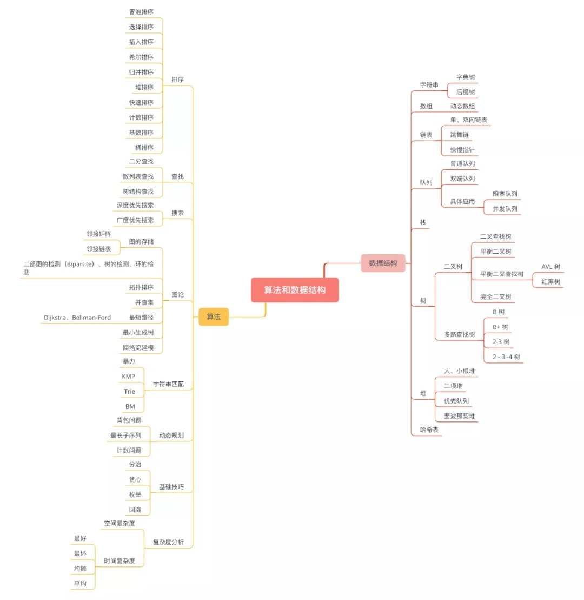

- [深入理解数据结构与算法](#深入理解数据结构与算法)
  - [前言](#前言)
  - [数据结构与算法总结](#数据结构与算法总结)
  - [OnlineJudge或书籍](#OnlineJudge或书籍)
  - [刷题记录](#刷题记录)
  - [LeetCode思维导图](#LeetCode思维导图)
  - [标签与模板](#标签与模板)

# 深入理解数据结构与算法

### 前言

大学里搞过2年ACM，基本上在解决的都是一些经典问题（基本都属于P类问题），比如线段树、树状数组、动态规划、KMP、AC自动机、BFS、DFS、最小生成树、图论问题等

ACM中的问题，对个人编程思维有很大帮助（算法思想是核心），对拿到面试offer也是一块不错的敲门砖，但是，它的实际应用价值不大，你很难在实际项目中找到一个问题，需要用到ACM中的某个具体算法去解决的，而实际应用中最常见的也不是P类问题，而是NP类问题或者NPC问题

P类问题、NP类问题、NPC问题
> P类问题：所有可以在多项式时间内求解的判定问题构成P类问题。<br>
> NP类问题：所有的非确定性多项式时间可解的判定问题构成NP类问题。<br>
> 非确定性算法：非确定性算法将问题分解成猜测和验证两个阶段。算法的猜测阶段是非确定性的，算法的验证阶段是确定性的，它验证猜测阶段给出解的正确性。<br>
> NPC问题：NP中的某些问题的复杂性与整个类的复杂性相关联，这些问题中任何一个如果存在多项式时间的算法，那么所有NP问题都是多项式时间可解的，这些问题被称为NP-完全问题（NPC问题）。

总的来说，我希望在P类问题中能做一些自己的总结，兴趣为主，以后也会有用，而也希望在NP类和NPC问题中能有所探索

写这篇文章有三个出发点
- 大学中做过的题并没有很好地记录下来，那么现在开始记录也为时不晚，我会将在各大OnlineJudge上（主要是leetcode、lintcode）刷过题，自认为有价值的，记录之
- 经典数据结构与算法问题，比如经典排序算法、红黑树、B+树、KMP等，在面试中考核较多的，我希望记录下来，有用
- NPC类问题有关算法的探索，比如拟退火算法、粒子群优化算法、遗传算法、蚁群优化算法等

### 数据结构与算法总结

以下是我的个人总结，我希望以一篇文章说清楚一个数据结构或算法，因此要求简明扼要，总结中会包含应用场景、核心思想、演示图解、代码例子等

- 线段树
- 树状数组
- [红黑树](数据结构与算法总结/红黑树.md)
- B+树
- KMP
- AC自动机

### OnlineJudge或书籍

|名称|全称|主页|
|--|--|--|
|ICPC|International Collegiate Programming Contest|https://icpc.global/|
|UESTC|University of Electronic Science and Technology of China|https://acm.uestc.edu.cn/home|
|Leetcode|The World's Leading Online Programming Contest|https://leetcode-cn.com/|
|Lintcode|A Powerful Coding Training System|https://www.lintcode.com/|
|Codeforces|A Programming competitions and contests, programming community|https://codeforces.com/|
|UVA|UVA Online Judge|https://onlinejudge.org/index.php|
|FromBook|《程序员代码面试指南》||

### 刷题记录

|序号|题意|题目|来源|大标签|小标签|题解|
|--|--|--|--|--|--|--|
|001|任意升序排序数列A的子串能否变成B|[contest1187_problemD](Codeforces/contest1187_problemD_任意升序排序数列A的子串能否变成B)|codeforces|白题|排列||
|002|求和为零的三元组的去重解|[problem15](Leetcode/problem15_求和为零的三元组的去重解)|leetcode|白题|二分||
|003|Kruskal算法求连通图的自定义函数解|[problem1395](UVA/problem1395_Kruskal算法求连通图的自定义函数解)|uva|图论|最小生成树||
|004|线段树单点加法区间求和|[problem838](UESTC/problem838_线段树单点加法区间求和)|uestc|数据结构|线段树||
|005|线段树区间加法区间求和|[problem839](UESTC/problem839_线段树区间加法区间求和)|uestc|数据结构|线段树||
|006|全排列能否被60整除|[contest1266_problemA](Codeforces/contest1266_problemA_全排列能否被60整除)|codeforces|白题|排列||
|007|基于最大公约数的矩阵构造题|[contest1266_problemC](Codeforces/contest1266_problemC_基于最大公约数的矩阵构造题)|codeforces|白题|构造||
|008|输出串是两个输入串的母序列且规则|[contest1272_problemF](Codeforces/contest1272_problemF_输出串是两个输入串的母序列且规则)|codeforces|动态规划|||
|009|商品打折券的最大化使用|[contest1282_problemB2](Codeforces/contest1282_problemB2_商品打折券的最大化使用)|codeforces|动态规划|||
|010|合并且排序K个指针表|[problem23](Leetcode/problem23_合并且排序K个指针表)|leetcode|白题|指针|[视频](https://www.bilibili.com/video/BV17T4y1F7Jy)|
|011|求解next_permutation|[problem31](Leetcode/problem31_求解next_permutation)|leetcode|白题|排列||
|012|求两个升序数列的中位数|[problem4](Leetcode/problem4_求两个升序数列的中位数)|leetcode|白题|二分||
|013|求1到X中数字1出现的次数|[problem233](Leetcode/problem233_求1到X中数字1出现的次数)|leetcode|动态规划|数列统计类||
|014|求一个数是否是有效数|[problem65](Leetcode/problem65_求一个数是否是有效数)|leetcode|白题|条件判断||
|015|求a到b中有多少个翻转对称数|[problem248](Leetcode/problem248_求a到b中有多少个翻转对称数)|leetcode|动态规划|数列统计类||
|016|最佳碰头地点|[problem296](Leetcode/problem296_最佳碰头地点)|leetcode|动态规划|||
|017|多条环路公交车线两点间最少上车次数|[problem815](Leetcode/problem815_多条环路公交车线两点间最少上车次数)|leetcode|搜索|广度优先搜索||
|018|计算三次最小生成树|[weekly-contest-205_problem4](Leetcode/weekly-contest-205_problem4_计算三次最小生成树)|leetcode|图论|最小生成树||
|019|求数列中长度大于2的等差子序列个数|[problem446](Leetcode/problem446_求数列中长度大于2的等差子序列个数)|leetcode|动态规划|||
|020|求数组的一个极大值|[problem162](Leetcode/problem162_求数组的一个极大值)|leetcode|白题|二分||
|021|求指定条件下房子涂色的最小花费|[problem1473](Leetcode/problem1473_求指定条件下房子涂色的最小花费)|leetcode|动态规划|||
|022|优雅的逆序一个栈|[problem1](FromBook/problem1_优雅的逆序一个栈)|frombook|数据结构|栈||

### LeetCode思维导图

下面图来自LeetCode公众号



### 标签与模板

以下是ACM题目中的标签，很多数据结构和算法问题没有实际应用价值，我现在也不会了————无奈的摊手。但不妨列出来，方便给上面的题目打标签

```
白题
|----数组、指针
|----二分、三分
|----构造
|----排列
|----暴力
|----条件判断

动态规划
|----公式推导
|----数学三角形
|----背包
|----公共子串、子序列
|----动态规划与其他结构结合

数据结构
|----队列、栈
|----堆
|----线段树
|----树状数组
|----主席树
|----动态树

字符串
|----字典树(Trie)
|----KMP、拓展KMP
|----AC自动机
|----后缀数组、后缀树
|----后缀自动机

图论
|----有向无环图(DAG)
|----并查集
|----最小生成树
     |----斯坦纳树
|----最短路
     |----Dikstra
     |----Bellman-Ford、SPFA
     |----Floyd
|----tarjan
|----网络流

搜索
|----广度优先搜索（BFS）、深度优先搜索（DFS）
|----启发式搜索
     |----A*算法
     |----Alpha-Beta算法
     |----模拟退火算法
     |----遗传算法
     |----蚁群算法
     |----粒子群优化算法

数学
|----几何
     |----叉积
     |----凸包
|----数论
     |----素数、素因数分解
     |----最大公约数(GCD)、最小公倍数(LCA)
     |----费马小定理
|----数学函数
     |----概率、期望
     |----排列、组合
     |----导数、微积分
     |----快速傅里叶变换(FFT)
     |----卡特兰数、超级卡特兰数
```

以下是新建一个题目时，README.md的模板，去掉"\"

```
# 题目
### 题意
\```
\```
### 条件范围
\```
\```
### 样例输入
\```
\```
### 样例输出
\```
\```
### 样例解释
\```
\```
### 关联链接
原题：
```
